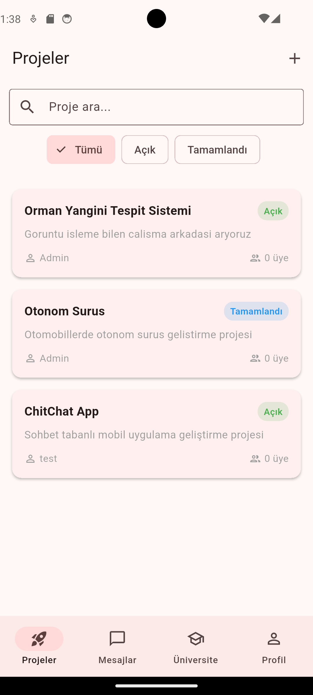
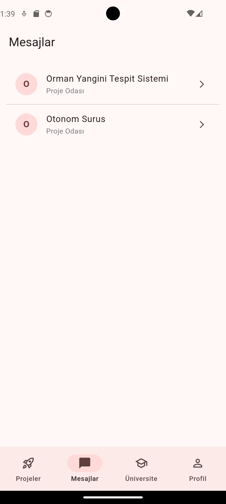
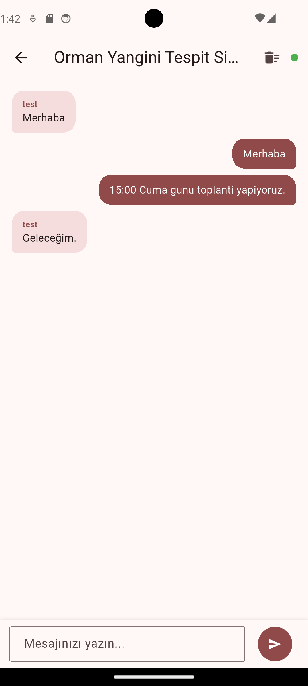
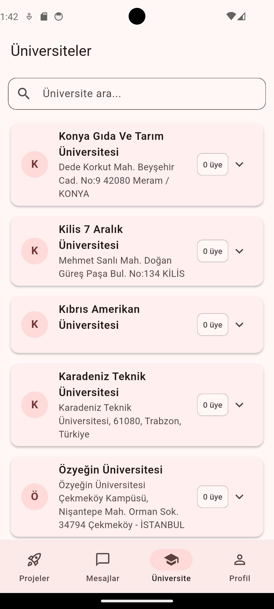
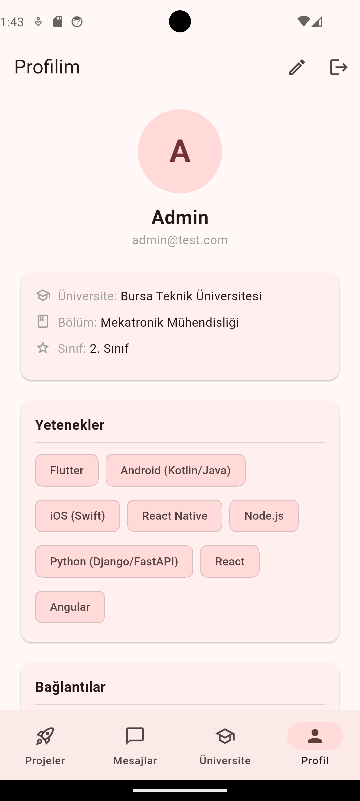

# HSD Proje & Ekip Arkadaşı Bulma Platformu 🚀

HSD (Huawei Student Developers) Mobil Uygulaması, üniversite öğrencilerinin projelerine ekip arkadaşı bulmalarını, yeteneklerine göre diğer öğrencilerle eşleşmelerini ve gerçek zamanlı olarak mesajlaşabilmelerini sağlayan kapsamlı bir mobil platformdur.

Bu proje, hem **Spring Boot** tabanlı güçlü bir backend mimarisine, hem de **Flutter** ile geliştirilmiş modern ve hızlı bir mobil arayüze sahiptir.

---

## 🌟 Öne Çıkan Özellikler

* **Kullanıcı Doğrulama & Yetkilendirme:** JWT (JSON Web Token) tabanlı güvenli kayıt ve giriş sistemi.
* **Detaylı Profil Yönetimi:** Kullanıcıların üniversite, bölüm, yetenekler (skills), bio, GitHub ve LinkedIn gibi profillerini düzenleyebilmesi.
* **Proje Yönetimi:** 
  * Yeni proje ilanları oluşturma (Aranan roller ve yetenekler ile birlikte).
  * Açık projelere başvuru yapma.
  * Proje sahiplerinin gelen başvuruları onaylaması (Kabul/Red).
* **Gerçek Zamanlı Mesajlaşma (WebSocket):**
  * Birebir doğrudan mesajlaşma.
  * Kabul edilen üyeler ve proje sahibi arasında otomatik kurulan **Proje Odası (Grup Sohbeti)**.
* **Üniversite & Topluluk Ağı:** Üniversiteleri listeleyip, hangi üniversiteden kaç üye olduğunu görme ve isme göre arama yapabilme yeteneği.

---

## 🛠️ Kullanılan Teknolojiler

### Backend (Sunucu Tarafı)
* **Java 17+** & **Spring Boot 3.x**
* **Spring Security & JWT** (Kimlik doğrulama için)
* **Spring Data JPA & Hibernate** (ORM ve veritabanı işlemleri)
* **PostgreSQL** (İlişkisel Veritabanı)
* **Spring WebSockets / STOMP** (Gerçek zamanlı mesajlaşma altyapısı)
* **Lombok** (Boilerplate kodları azaltmak için)

### Frontend (İstemci Tarafı)
* **Flutter & Dart** (Çapraz platform mobil arayüz)
* **Provider** (State Management / Durum Yönetimi)
* **STOMP Dart Client** (WebSocket istemcisi)
* **Material Design 3** (Modern ve akıcı kullanıcı arayüzü bileşenleri)
* **Shared Preferences** (Yerel veri ve token önbellekleme)

---

## 📱 Ekran Görüntüleri ve Kullanım

* **Ana Sayfa:** Güncel ve aktif projeler listelenir.
 

  

* **Mesajlar:** Katıldığınız projelerin sohbet odaları ve direkt mesajlarınız (WebSocket tabanlı) yer alır. Anlık yenileme için sayfayı aşağı kaydırabilirsiniz.
  

  
  &nbsp; &nbsp; &nbsp;
  

* **Üniversiteler:** Platformu kullanan diğer kişilerin hangi üniversitelerde okuduğunu listeleyebilir, arama yapabilirsiniz.
  

  

* **Profil:** Kendi yeteneklerinizi seçtiğiniz, açık kaynak projelerinizi veya profesyonel ağlarınızı eklediğiniz kontrol merkezidir.
  

  

---

